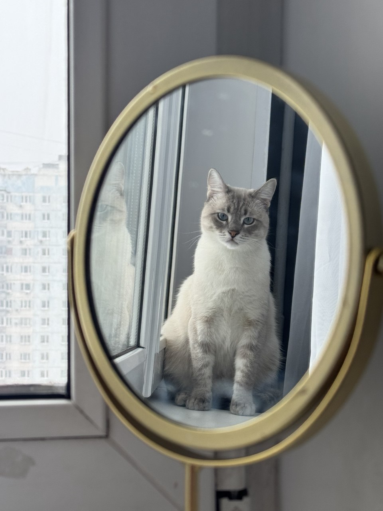

# Марфа - наша авторитетная красавица

## Характеристики:
| Параметр      | Значение      |
|--------------|----------------|
| Порода       | Тайская        |
| Окрас        | Серый мраморный|
| Возраст      | 5 лет          |
| Вес          | 4.2 кг         |
| Характер     | Имеется        |

## Описание:
Марфа - моя первая кошка. Настоящий контролер, который ни одно действие на оставит без присмотра и строго замечания "Мяу!". Невероятно сообразительная и хитрая. Спокойно ворует сладости и ни о чем не жалеет. Даже если это мои сладости! 

Не терпит халатности в быту. Слушается только меня, и то — с выражением глубокой внутренней борьбы и лёгкой обидой, что на нее посмели повысить голос на пятую просьбу не хулиганить. 

К моей подружке-соседке относится, как к фоновому элементу интерьера. Та может заходить, кормить, разговаривать — Марфа терпит. Иногда, великодушно, позволяет себя погладить. Иногда — делает вид, что никого не было. Снисходительность — её вторая шерсть.

Обожает носиться по дому так, будто её только что вызвали на кошачьи олимпийские игры. Порой среди ночи. Порой с прыжком через стул. Порой с торжествующим "Мяу!"!

И да — шоколад.
Марфа его не просто любит. Она его обожает, жаждет, выслеживает каждую крошку на полку в поисках того самого сокровища. Услышит шелест обёртки — и тут же появляется, будто вызвали по имени. 

Марфа — не просто кошка. Это личность с убеждениями, слабостью к шоколаду и выраженной уверенностью, что этот мир построен ради неё. И, честно, поспорить с ней трудно.

Особенности:
- Трогать можно только если зверь голоден или спит
- Любит наблюдать за трусливыми птицами из окна
- Спит по 18 часов в день, но ни в коем случае не в ночь
- Не любит громких звуков, если это не ее "Мяу!"

## Любимые занятия:
1. Кошмарить всех в доме
2. Искать шоколад в мусорке
3. Воровать вещи со стола

[Вернуться на главную →](/index.md)