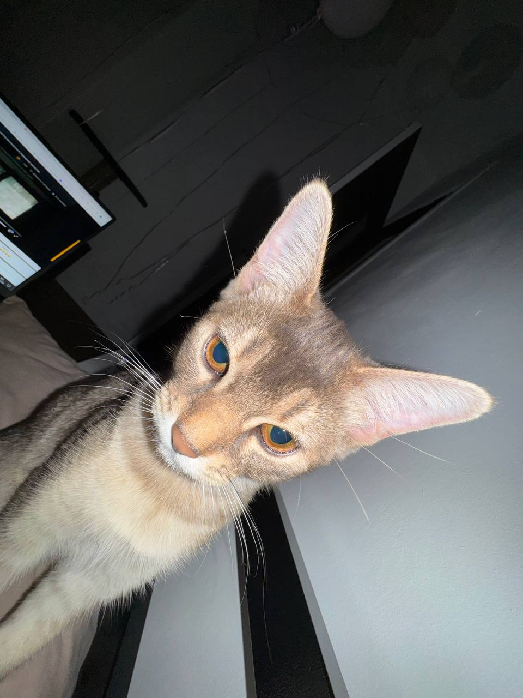

# Сима - наша озорная непоседа

## Характеристики:
| Параметр      | Значение     |
|--------------|---------------|
| Порода       | Абиссинец     |
| Окрас        | Как у шиншиллы|
| Возраст      | 6 месяцев     |
| Вес          | 1,5 кг        |
| Характер     | Бешеный       |

## Описание:
Сима - наша вторая кошка, цирк, хаос и воплощение закона непредсказуемости. Ей всего полгода, а она уже ведёт себя как опытный профессионал в области угона мусора и нарушении порядка. 

Там, где нужно быть смелой — она шарахается, как будто увидела призрак пылесоса. Зато в опасные зоны — в раковину, в подъезд, на край духовки — летит, как храбрая мышь на веселых веществах. Спать обожает именно в раковине, свернувшись колачиком и помня о приближающемся "обэде". Кто её такому научил — не рассказывает.

Каждый раз, когда Лера выходит из комнаты, Сима немедленно считает это командой: "Кушать!" Бежит к миске с лицом, полным надежды. Причём даже если миска полная. Даже если она только что ела. Даже если прям с руки.

С Марфушей у них своя игра. Кто за кем куда и зачем — мы ничего не успеваем понять. Марфа фыркает, Сима — бежит, вещи — летят. Иногда ловит по шапке, но моментально забывает и снова несётся.

Фраза «сейчас дам по попо» — это единственное, что может на секунду включить тормоза. Но буквально на секунду. Потом снова: стойка на задних лапах, уши врозь, хвост — антенна, а в глазах — мечты о собственном спорткаре.

Сима — не просто котёнок. Это крошечная искра анархии, живущая по своим законам и с раковиной в душе.

Особенности:
- Встаёт на задние лапы, как сурикат, если что-то интересно (а интересно — всё)
- Имитирует голод каждые 7 минут
- Любит приносить игрушки
- Может не слушаться даже если шепчат собственные инстинкты

## Любимые занятия:
1. Встаёт на задние лапы, как сурикат, если что-то интересно (а интересно — всё)
2. Имитирует голод каждые 7 минут
3. Может не слушаться даже если подсказывают собственные инстинкты

[Вернуться на главную →](/index.md)